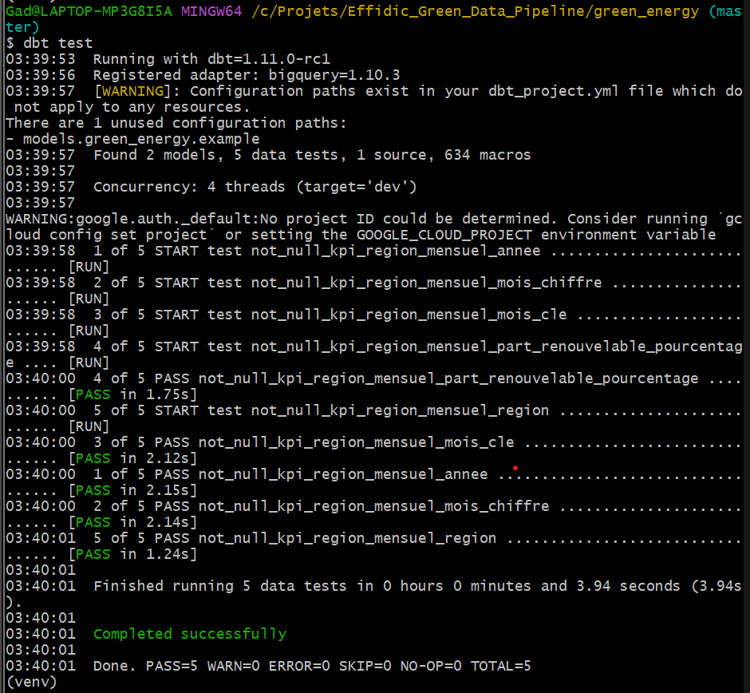

# 🌿 Green Energy Data Engineering Project  
Modern Data Stack – ELT Pipeline for Renewable Energy Analytics  

[](https://lookerstudio.google.com/s/u-64-Hc96RQ)
[](https://your-demo-link.com)

---

## 📛 Badges

  
  
  
  


---

## ⭐ Features

- Complete **Modern Data Stack (MDS)**
- Fully automated **ELT pipeline**
- Cloud data warehouse on **Google BigQuery**
- **dbt transformations** with modular modeling
- Automated **data quality tests** (DataOps)
- Analytical KPIs (Region × Month)
- YoY time-series comparison
- Interactive **Looker Studio dashboard**
- Reproducible, version-controlled environment
- Cloud-deployable architecture

---

## 🏗️ Architecture Overview

This project processes raw renewable energy data to compute granular KPIs supporting decision-making for energy transition.

### 🔧 Components

| Layer | Technology | Purpose |
|-------|------------|---------|
| Extract & Load | Python | Load raw CSV files to BigQuery |
| Data Warehouse | BigQuery | Serverless scalable storage |
| Transform | dbt Core | Modeling, cleaning, KPI creation |
| Visualization | Looker Studio | Dashboards ([Live Dashboard](https://lookerstudio.google.com/s/u-64-Hc96RQ)) |
| Infra & Tools | Git, Bash, Python venv | Automation & reproducibility |

---

## 📊 Analytical Results & KPIs

The pipeline produces a final analytics table:

### **`dbt_production.kpi_region_mensuel`**

#### Main Indicators
- **Renewable Share (%)** → `part_renouvelable_pourcentage`
- **Total Consumption (GWh)**

#### Dimensions for Time-Series Analysis
- `annee`
- `mois_chiffre`

---

## 📈 Dashboard Preview

[](https://lookerstudio.google.com/s/u-64-Hc96RQ)

---

## 🔐 Data Quality (DataOps via dbt)

dbt ensures reliability through automated tests:

- `not_null` on `region`, `annee`, `mois_cle`
- KPI validity checks

**Status:** ✔️ *PASS — 5 critical tests validated*



---

## 🛠️ Tech Stack

### Languages
- Python 3.10+
- SQL (BigQuery Standard SQL)

### Tools
- dbt Core  
- Google BigQuery  
- Looker Studio  
- Git / GitHub  

### Python Libraries
- pandas  
- google-cloud-bigquery  
- dbt-bigquery  

---

## 🧩 Installation & Setup

```bash
# 1. Clone the repository
git clone https://github.com/CaptainA10/Green_Data_Pipeline.git
cd Green_Data_Pipeline/green_energy

# 2. Install dependencies
pip install -r requirements.txt
dbt deps

# 3. Run dbt transformations and tests
dbt run
dbt test
```
Configure BigQuery (profiles.yml)

Create or edit:

~/.dbt/profiles.yml

green_energy:
  target: dev
  outputs:
    dev:
      type: bigquery
      method: service-account
      keyfile: "path/to/your-service-account.json"
      project: "your-project-id"
      dataset: "dbt_production"
      threads: 4


🚀 Deployment Guide

Create the dbt_production dataset in BigQuery

Upload raw datasets using ingestion scripts

Run dbt via CI/CD (GitHub Actions, GitLab CI, dbt Cloud)

Publish your Looker Studio dashboard → Live Dashboard

🤝 Contributing

Fork the repository

Create a feature branch

Commit with meaningful messages

Open a Pull Request

👨‍💻 Author

NGUETTE FANE Gad
Data Engineer Student – Cloud & Analytics

📧 Email: nguettefanegad@gmail.com
